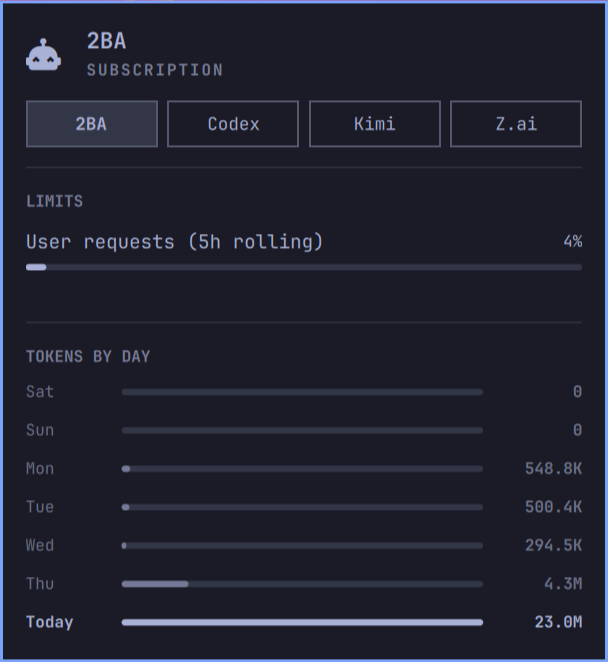

# Agent Usage: 2BA

An Omarchy service plugin that adds a **2BA** tab to the built-in Agents panel.



It reads `https://api.2ba.ai/v1/usage` every five minutes and on shell startup,
publishing `2ba.json` atomically under `$XDG_STATE_HOME/omarchy/agents/usage`
(default `~/.local/state/omarchy/agents/usage`). Requires Python 3 and Omarchy.

Shows today's tokens and seven daily bars for the whole account — every API
key of the authenticated user — matching the user-scoped quota. Dates are
UTC. The published record also includes a `usageSummaryText` with the
request/token totals for the last 30 days of the authenticated key only;
requests made with other keys, even in the same organization, are excluded
from that line.
The tab also shows rolling-window request usage/remaining capacity, and
concurrent request usage when capped. These quotas apply across all of the
user's keys, including when the plan is inherited from the organization
default. A user-specific plan overrides that default. The API does not expose
the plan's name or id — only whether it is inherited — so the tab shows the
quota meters without a plan heading.

The next capacity release and exact remaining counts are included in
`usageSummaryText`. The current Agents panel does not render that summary; it
shows the quota meters. Its status box is reserved for errors.
The next release is not a full reset: requests leave the sliding window
individually. Model breakdowns and session counts are not included.

## Authentication

The collector reads `TWOBA_API_KEY`, then `2BA_API_KEY`, then the installer's
existing `~/.config/2ba/2BA_API_KEY`. This path intentionally matches the 2ba
installer even when `XDG_CONFIG_HOME` is set. Environment variables must be
available to the Omarchy shell process; using the key file avoids that setup.

If you already used the 2ba installer, no new login is needed. Otherwise:

```sh
./collectors/omarchy-agent-usage-2ba --login
```

This uses 2ba's browser pairing flow:

1. POST `https://2ba.ai/api/auth/device/code`.
2. Open the returned `/link?code=...` URL; sign in and approve the matching code.
3. Poll `/api/auth/device/token` with the private device code.
4. Save the returned API key atomically with mode `0600`, at the installer's path.

Pairing requires an active subscription. It uses the existing default
`install.sh` client, so the generated key is named `install-YYYYMMDD`. Running
`--login` creates a new key and replaces the saved key; existing keys are not
revoked. **A newly created key starts with no usage.** Configure your coding tool
to use that same key, or reuse its existing 2ba installer key for meaningful stats.

Credentials are sent only to `2ba.ai` and `api.2ba.ai` over HTTPS. Redirects are
refused. Neither API keys nor device secrets appear in usage records or logs.
The background collector never launches a browser.

## Install

```sh
omarchy plugin add https://github.com/sorenmat/omarchy-agent-usage-2ba.git --enable
```

The built-in `omarchy.agents` panel must also be enabled.

## Local development installation

For this local source directory:

```sh
plugin_dir="$HOME/.config/omarchy/plugins/smo.agent-usage-2ba"
install -d "$plugin_dir/collectors"
install -m 644 manifest.json Service.qml "$plugin_dir/"
install -m 755 collectors/omarchy-agent-usage-2ba "$plugin_dir/collectors/"
omarchy-shell shell rescanPlugins
```

Once `omarchy plugin list` shows `smo.agent-usage-2ba`, enable it:

```sh
omarchy plugin enable smo.agent-usage-2ba
```

Run these commands from this directory. Omarchy discovers new plugins
asynchronously. `omarchy plugin add` is for a committed Git repository; this
workspace can be installed directly as above.

## Backend

Heimdall provides **GET `/v1/usage`** on `api.2ba.ai`.
The deployed endpoint was verified on September 11, 2026, including the
user's rolling-window quota. Older deployments without the endpoint return
HTTP 404, which the widget reports as unavailable data.

The endpoint accepts `Authorization: Bearer <api-key>` or `X-Api-Key: <api-key>`.
Heimdall's generated keys are 64 hexadecimal characters; no `sk-` prefix is required.
It requires an API key, uses the authenticated key ID from middleware, and offers
no key/user/org selectors. On custom domains it additionally enforces the
existing domain-to-organization match. `/api/*` and `/auth/*` remain blocked.
It returns `Cache-Control: no-store`, a fixed rolling 30-day history, a
`user_stats` aggregate over all of the user's keys in the same 30-day UTC
shape as the key-scoped totals, and a separate user-scoped `quota` snapshot
from the enforcement counters. Reading quota does not consume capacity. The
`plan` object carries only the `inherited` flag; the plan's id and name are
internal organization details and are not exposed to key holders. An assigned
plan whose state cannot be read returns HTTP 503; an unassigned plan reports
`enforcement: "unlimited"` and no limits. Example:

```json
{
  "scope": "api_key",
  "start": "2026-08-12T12:00:00Z",
  "end": "2026-09-11T12:00:00Z",
  "timezone": "UTC",
  "total_requests": 2,
  "total_tokens": 1200,
  "daily_stats": [{"date": "2026-09-11", "requests": 2, "tokens": 1200}],
  "user_stats": {
    "scope": "user",
    "total_requests": 30,
    "total_tokens": 90000,
    "daily_stats": [{"date": "2026-09-11", "requests": 3, "tokens": 1200}]
  },
  "quota": {
    "scope": "user",
    "enforcement": "active",
    "measured_at": "2026-09-11T12:00:00Z",
    "plan": {"inherited": true},
    "limits": [{
      "scope": "user", "metric": "requests", "window_type": "rolling",
      "window_seconds": 18000, "limit": 4500, "used": 1200,
      "remaining": 3300, "next_release_at": "2026-09-11T12:30:00Z"
    }]
  }
}
```

## Verify

```sh
python3 -m unittest -v test_collector.py
omarchy plugin validate .
/usr/lib/qt6/bin/qmllint -I /usr/share/omarchy/shell Service.qml
./collectors/omarchy-agent-usage-2ba | jq .
```

`--force` and `--limits-only` are accepted for Omarchy compatibility. Scans have
no cache, always print one JSON record, and exit zero even when the API fails.

## Remove

```sh
omarchy plugin remove smo.agent-usage-2ba
rm -f "${XDG_STATE_HOME:-$HOME/.local/state}/omarchy/agents/usage/2ba.json"
```

The last record must be removed because the panel has no expiry. The shared
2ba installer key is retained.

## License

MIT; see [LICENSE](LICENSE).
